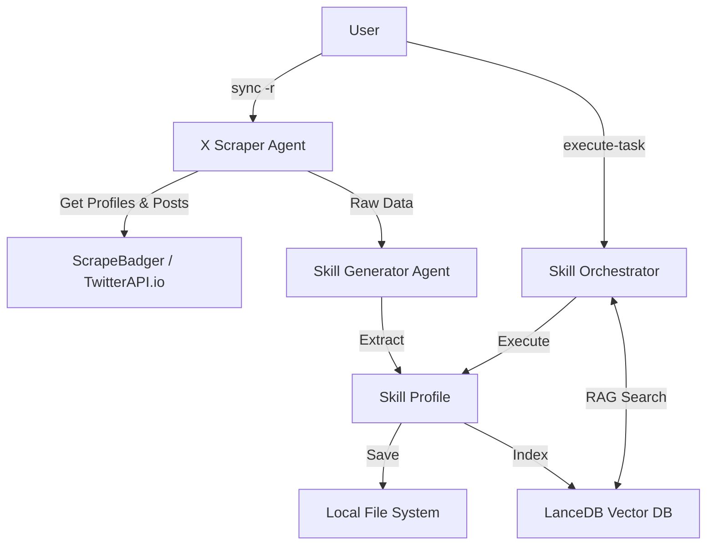

# GEMINI.md

## Project Overview

**Skiller** is an advanced AI agent system that "clones" the expertise of people you follow on X (Twitter). It analyzes their high-quality posts to understand their unique insights, communication style, and core skills, effectively turning your social graph into a usable **Skill Network**.

### Key Technologies
- **Backend:** Python (>= 3.13), [Agno](https://docs.agno.com/) (Agent Framework), FastAPI, [cli2](https://cli2.readthedocs.io/) (CLI).
- **AI/LLM:** Pollinations.ai (Default Provider), Mistral AI (Fallback), [LangWatch](https://langwatch.ai/) (Prompt Management & Monitoring).
- **Storage:** [LanceDB](https://lancedb.com/) (Local Vector DB for RAG), SQLite (Session & State management via SQLAlchemy), Supermemory (Optional Cloud Sync).
- **Scraping:** ScrapeBadger (Primary), TwitterAPI.io, Firecrawl, Apify.
- **Frontend:** Next.js 15+, React 18, Tailwind CSS, Radix UI, Framer Motion, Zustand.
- **Package Management:** `uv` (Python), `bun` (Frontend).

## Architecture



## Getting Started

### Prerequisites
- **Python 3.13+** with `uv` installed.
- **Node.js/Bun** for the frontend.
- **API Keys:** Mistral, LangWatch, ScrapeBadger (required).

### Installation
```bash
# Backend CLI installation
uv tool install -e .

# Environment setup
cp .env.example .env
# Edit .env with your API keys
```

### Key Backend Commands
- `skiller --help`: List all available commands.
- `skiller sync -r -u <username>`: Rebuild the network for a specific X user.
- `skiller build-network-skills`: Generate skill profiles for fetched handles.
- `skiller execute-task "<task>"`: Task your network to solve a problem.
- `skiller sync -l`: List all currently indexed skills.

### Frontend Development
```bash
cd agentui
bun install
bun run dev # Starts on http://localhost:3000
```

## Development Conventions

### Python Backend
- **Dependency Management:** Always use `uv`.
- **Agent Development (Agno):**
    - **Never** create agents in loops; reuse agent instances for performance.
    - Use `output_schema` (Pydantic models) for structured responses.
    - Start with a single agent and scale to Teams/Workflows only when necessary.
- **Prompt Management (LangWatch):**
    - **Never** hardcode prompts in application code.
    - Use the centralized `get_llm_model` factory in `app/utils/llm.py`.
    - Use the LangWatch Prompt CLI: `langwatch prompt create <name>`.
    - Run `langwatch prompt sync` after modifying YAML files in `prompts/`.
- **Testing:**
    - Use **Scenario Tests** (`tests/scenarios/`) for end-to-end agent validation.
    - Use **Evaluations** (`tests/evaluations/` notebooks) for RAG accuracy or classification tasks.
    - Always load `dotenv` in tests to ensure API keys are available.

### Frontend
- **Framework:** Next.js with App Router.
- **Styling:** Tailwind CSS with Radix UI primitives.
- **Package Manager:** `bun` is the preferred tool for the `agentui` directory.
- **Validation:** Run `bun run validate` before committing to check linting, formatting, and types.

## Directory Structure
- `app/`: Main Python application logic (agents, tools, models, utils).
- `agentui/`: Next.js frontend application.
- `prompts/`: Versioned prompt files (managed via LangWatch).
- `skills/`: Local storage for generated skill profiles (Markdown).
- `data/`: Local databases (LanceDB, SQLite).
- `tests/`: Scenario tests and evaluation notebooks.
- `docs/`: Project documentation (Architecture, Contributing).
