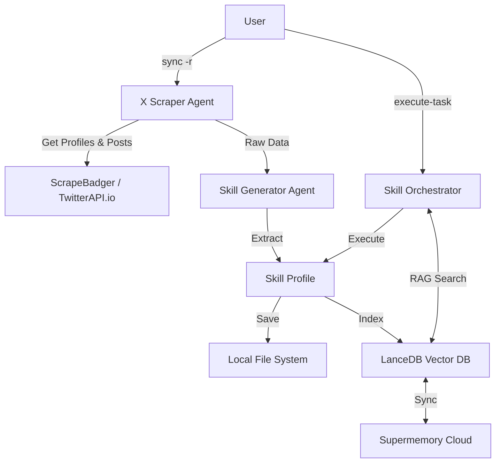

# Skiller 🧠

> **Turn your X (Twitter) network into a powerful team of AI experts.**

**Skiller** is an advanced AI agent that "clones" the expertise of the people you follow on X. It analyzes their posts to understand their unique insights, communication style, and core skills, effectively turning your social graph into a usable **Skill Network**.

You can then task this network to solve complex problems, and Skiller will orchestrate the perfect "expert" from your connections to get the job done.

---

### ✨ Features

- **🕸️ Robust Network Scraping**: Automatically finds and analyzes profiles you follow on X using **ScrapeBadger** (primary) with fallback to **TwitterAPI.io**.
- **⚖️ Load Balancing**: Built-in multi-key support for scraping tools to handle rate limits gracefully.
- **🧠 Intelligent Skill Generation**: Extracts "Skill Profiles" (expertise, style, unique insights) from raw posts using advanced LLM analysis.
- **🔍 RAG-Powered Search**: Uses local LanceDB with hybrid search (semantic + keyword) for intelligent skill retrieval.
- **🔄 Smart Synchronization**: Full clean-rebuild capabilities (`sync -r`) to ensure your skill network is always fresh and accurate.
- **☁️ Optional Cloud Sync**: Backup skills to Supermemory for cross-device access.
- **🤖 Intelligent Orchestration**: Uses Think → Search → Analyze reasoning cycle to select the best expert.
- **🔌 Extensible Architecture**: Built on **Agno**, allowing for easy addition of new tools and capabilities.

---

### 🛠️ Prerequisites

Before you begin, ensure you have the following API keys:

- **Mistral API Key**: For the core LLM intelligence and embeddings.
- **LangWatch API Key**: For prompt management and monitoring.
- **ScrapeBadger API Key**: Primary tool for scraping X followings and posts (highly recommended).
- **(Optional) TwitterAPI.io API Key**: Secondary fallback for follower/following data.
- **(Optional) Firecrawl API Key**: Additional scraping support.
- **(Optional) Supermemory API Key**: For cloud sync of skills.

> **Note**: ScrapeBadger is the preferred scraping method due to its reliability and resistance to bot detection.

---

### 📦 Installation

Skiller is built to be installed effortlessly using `uv`.

1. **Clone the repository:**
   ```bash
   git clone https://github.com/Ash-Blanc/skiller.git
   cd skiller
   ```

2. **Install the CLI tool:**
   ```bash
   uv tool install -e .
   ```

3. **Verify the installation:**
   ```bash
   skiller --help
   ```

---

### ⚙️ Configuration

1. **Create your environment file:**
   Copy the example file to `.env`:
   ```bash
   cp .env.example .env
   ```

2. **Add your API Keys:**
   Open `.env` and fill in your keys. Skiller supports multiple keys for scraping tools (comma-separated) for load balancing.

   ```bash
   # LLM Provider
   MISTRAL_API_KEY=...

   # Monitoring & Prompts
   LANGWATCH_API_KEY=...

   # Scraping Tools
   # You can provide multiple keys separated by commas for load balancing
   SCRAPEBADGER_API_KEY=key1,key2
   TWITTERAPIIO_API_KEY=key1,key2
   FIRECRAWL_API_KEY=key1
   
   # Optional Cloud Memory
   SUPERMEMORY_API_KEY=...
   ```

---

### 🖥️ Usage

#### 1. Build Your Network
The first step is to sync your X network. You can do a full rebuild which fetches fresh followings and posts.

**Full rebuild from X (Recommended):**
```bash
# Fetches followings for the user, scrapes posts, and generates skills
skiller sync -r -u your_x_username
```

**Build from specific handles:**
If you want to curate specific experts or avoid a full sync:
```bash
skiller sync -r --handles "user1,user2,user3"
```

**Build from a file:**
Useful if you have a curated list of handles in a file (one per line):
```bash
skiller sync -r -f handles.txt
```

#### 2. Generate Skills
Once the raw data is synced (or if you just want to regenerate skills from existing data):
```bash
skiller build-network-skills
```

#### 3. Execute Tasks
Now leverage your network to solve problems. Skiller will find the right expert(s) for the job.

```bash
skiller execute-task "Analyze the latest trends in LLM reasoning based on my network's insights"
```

#### 4. Manage Skills
```bash
skiller sync --list                          # List all currently indexed skills
skiller sync -c                              # Sync local skills to Supermemory cloud
```

---

### 🏗️ Architecture



---

### 📚 Documentation

- [**Architecture Guide**](docs/ARCHITECTURE.md): Deep dive into the agents, pipeline, and storage layer.
- [**Contributing Guide**](docs/CONTRIBUTING.md): How to set up development and submit PRs.

### 🛡️ License

[MIT](LICENSE)
