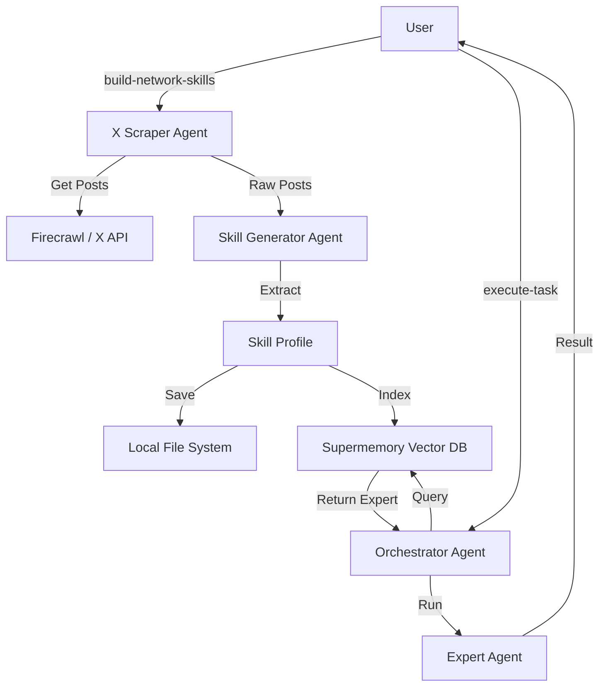

# Skiller 🧠
> **Turn your X (Twitter) network into a powerful team of AI experts.**

**Skiller** is an advanced AI agent system that "clones" the expertise of the people you follow on X. It analyzes their posts to understand their unique insights, communication style, and core skills, effectively turning your social graph into a usable **Skill Network**.

You can then task this network to solve complex problems, and Skiller will orchestrate the perfect "expert" from your connections to get the job done.

---

## ✨ Features

- **🕸️ Network Scraping**: Automatically finds and analyzes profiles you follow on X.
- **🧠 Skill Generation**: Extracts "Skill Profiles" (expertise, style, unique insights) from raw posts using advanced LLM analysis.
- **💾 Dual Storage**: Saves skills locally (as Agno Skills) and in **Supermemory** (vector database) for semantic retrieval.
- **🤖 Intelligent Orchestration**: Dynamically selects the best expert for any given task.
- **🔌 Extensible Architecture**: Built on **Agno**, allowing for easy addition of new tools and capabilities.

---

## 🛠️ Prerequisites

Before you begin, ensure you have the following API keys:

- **Mistral API Key**: For the core LLM intelligence (using `mistral-large-latest`).
- **LangWatch API Key**: For prompt management and monitoring.
- **Firecrawl API Key**: For scraping X profiles and posts.
- **Supermemory API Key**: For storing and retrieving vector embeddings of skills.
- **(Optional) X / Twitter API Keys**: For more robust data fetching (fallback).

---

## 📦 Installation

1. **Clone the repository:**
   ```bash
   git clone https://github.com/yourusername/skiller.git
   cd skiller
   ```

2. **Install the CLI tool using `uv`:**
   ```bash
   uv tool install -e .
   ```

3. **Verify the installation:**
   ```bash
   skiller --help
   ```

> [!TIP]
> If you don't have `uv` installed, you can get it via:
> ```bash
> curl -LsSf https://astral.sh/uv/install.sh | sh
> ```

---

## ⚙️ Configuration

1. **Create your environment file:**
   Copy the example file to `.env`:
   ```bash
   cp .env.example .env
   ```

2. **Add your API Keys:**
   Open `.env` and fill in your keys:
   ```bash
   # LLM Provider
   MISTRAL_API_KEY=...

   # Monitoring & Prompts
   LANGWATCH_API_KEY=...

   # Scraping & Memory
   FIRECRAWL_API_KEY=...
   SUPERMEMORY_API_KEY=...
   
   # Optional: X API
   X_BEARER_TOKEN=...
   ```

---

## 🖥️ Usage

Skiller is controlled via a simple CLI.

### 1. Build Your Skill Network
This command scrapes your network (or a specific user's network) and generates AI skills for them.

```bash
# Build skills from the people @user follows
skiller build-network-skills --username "user_handle" --max-following 10 --posts-per-user 5
```
*   `--username`: The X handle to analyze.
*   `--max-following`: How many profiles to process (default: 10).
*   `--posts-per-user`: How many posts to analyze per profile (default: 5).

### 2. Execute Tasks
Once your network is built, you can ask Skiller to perform data-driven tasks using the expertise it has gathered.

```bash
skiller execute-task "Analyze the latest trends in LLM reasoning based on my network's insights"
```

The system will:
1.  **Search** your skill database (Supermemory) for the most relevant expert.
2.  **Load** that expert's specific persona and instructions.
3.  **Execute** the task using that expert's perspective.

---

## 🏗️ Architecture



## 🛡️ License

[MIT](LICENSE)
