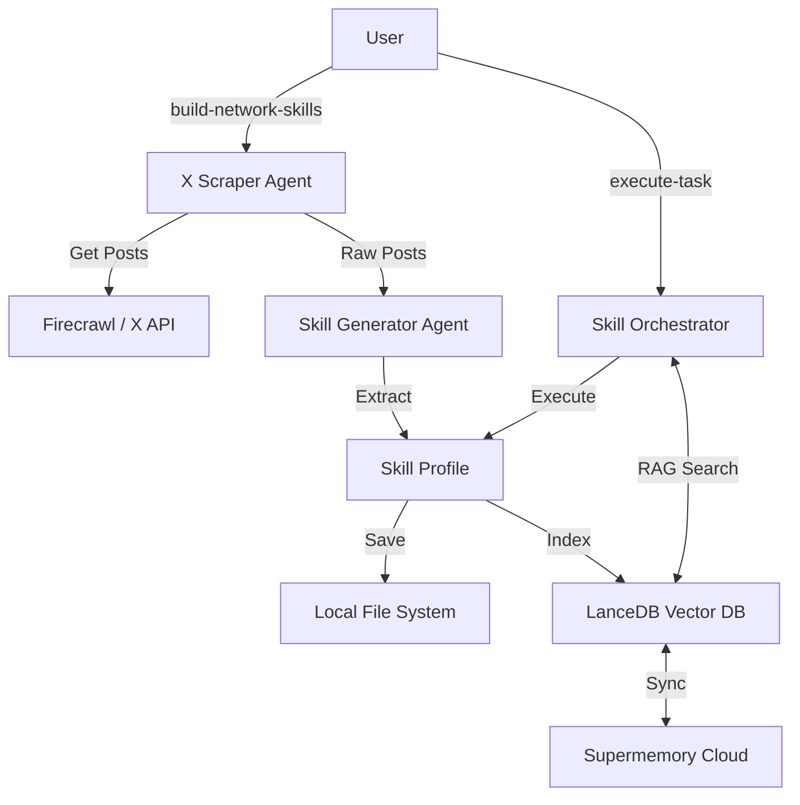

# Skiller 🧠
> **Turn your X (Twitter) network into a powerful team of AI experts.**

**Skiller** is an advanced AI agent that "clones" the expertise of the people you follow on X. It analyzes their posts to understand their unique insights, communication style, and core skills, effectively turning your social graph into a usable **Skill Network**.

You can then task this network to solve complex problems, and Skiller will orchestrate the perfect "expert" from your connections to get the job done.

---

### ✨ Features

- **🕸️ Network Scraping**: Automatically finds and analyzes profiles you follow on X.
- **🧠 Skill Generation**: Extracts "Skill Profiles" (expertise, style, unique insights) from raw posts using advanced LLM analysis.
- **🔍 RAG-Powered Search**: Uses local LanceDB with hybrid search (semantic + keyword) for intelligent skill retrieval.
- **☁️ Optional Cloud Sync**: Optionally sync skills to Supermemory for cross-device access.
- **🤖 Intelligent Orchestration**: Uses Think → Search → Analyze reasoning cycle to select the best expert.
- **🔌 Extensible Architecture**: Built on **Agno**, allowing for easy addition of new tools and capabilities.

---

### 🛠️ Prerequisites

Before you begin, ensure you have the following API keys:

- **Mistral API Key**: For the core LLM intelligence and embeddings.
- **LangWatch API Key**: For prompt management and monitoring.
- **Firecrawl API Key**: For scraping X profiles and posts.
- **(Optional) Supermemory API Key**: For cloud sync of skills.
- **(Optional) X / Twitter API Keys**: For more robust data fetching.

---

### 📦 Installation

1. **Clone the repository:**
   ```bash
   git clone https://github.com/yourusername/skiller.git
   cd skiller
   ```

2. **Install the CLI tool using `uv`:**
   ```bash
   uv tool install -e .
   ```

3. **Verify the installation:**
   ```bash
   skiller --help
   ```

---

### ⚙️ Configuration

1. **Create your environment file:**
   Copy the example file to `.env`:
   ```bash
   cp .env.example .env
   ```

2. **Add your API Keys:**
   Open `.env` and fill in your keys:
   ```bash
   # LLM Provider
   MISTRAL_API_KEY=...

   # Monitoring & Prompts
   LANGWATCH_API_KEY=...

   # Scraping & Memory
   FIRECRAWL_API_KEY=...
   SUPERMEMORY_API_KEY=...
   ```

---

### 🖥️ Usage

**Build skills from your network:**
```bash
skiller build-network-skills --username "your_handle"
```

**Execute a task with your expert team:**
```bash
skiller execute-task "Analyze the latest trends in LLM reasoning based on my network's insights"
```

**Sync and manage skills:**
```bash
skiller sync --list
skiller sync --rebuild
```

---

### 🏗️ Architecture



### 📚 Documentation

- [**Architecture Guide**](docs/ARCHITECTURE.md): Deep dive into the agents, pipeline, and storage layer.
- [**Contributing Guide**](docs/CONTRIBUTING.md): How to set up development and submit PRs.

### 🛡️ License

[MIT](LICENSE)
